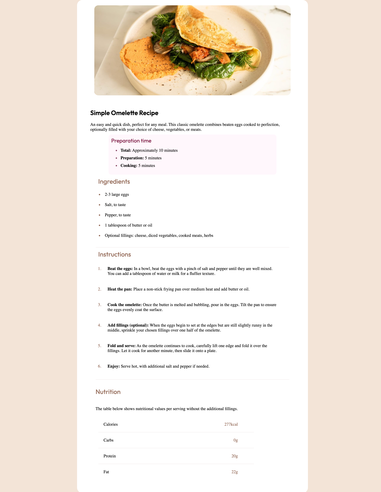

# Frontend Mentor - Recipe page solution

This is a solution to the [Recipe page challenge on Frontend Mentor](https://www.frontendmentor.io/challenges/recipe-page-KiTsR8QQKm). Frontend Mentor challenges help you improve your coding skills by building realistic projects. 

### Screenshot

### Links

- Solution URL: [https://github.com/nj93777/recipe-page-main]
- Live Site URL: [Add live site URL here](https://your-live-site-url.com)

### Built with
- CSS custom properties
- Flexbox
- Mobile-first workflow
